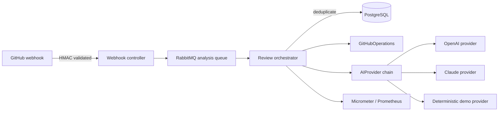
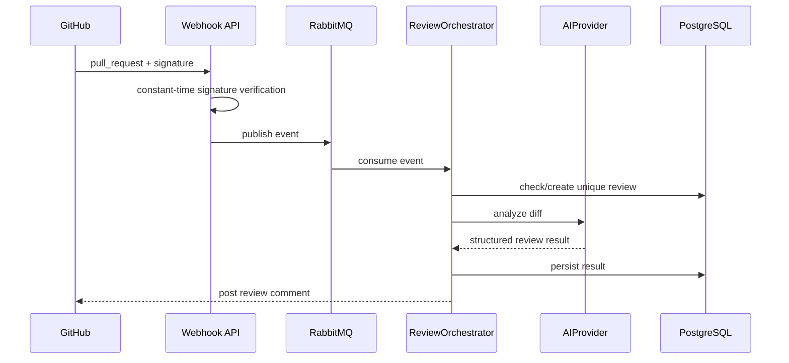

# Architecture

CodeSage accepts GitHub pull-request events, queues review work, fetches a diff, analyzes it through an `AIProvider`,
persists the result, and posts a review comment.

## Boundaries

- `AIProvider` isolates analysis implementations and fallback order.
- `GitHubOperations` isolates external GitHub behavior.
- `ReviewOrchestrator` owns duplicate prevention and the end-to-end review transaction.
- RabbitMQ routes rejected messages through a retry queue and then a dead-letter queue.

## Trade-offs

- Remote OpenAI and Claude providers use bounded diff input, JSON-only review prompts, timeout, retry, and circuit
  breaker policies. The deterministic provider remains the no-secrets fallback for demo and repeatable tests.
- The database uniqueness constraint prevents concurrent duplicate reviews for one repository/PR number. A future
  version should include the PR head SHA to permit a new review after synchronization.
